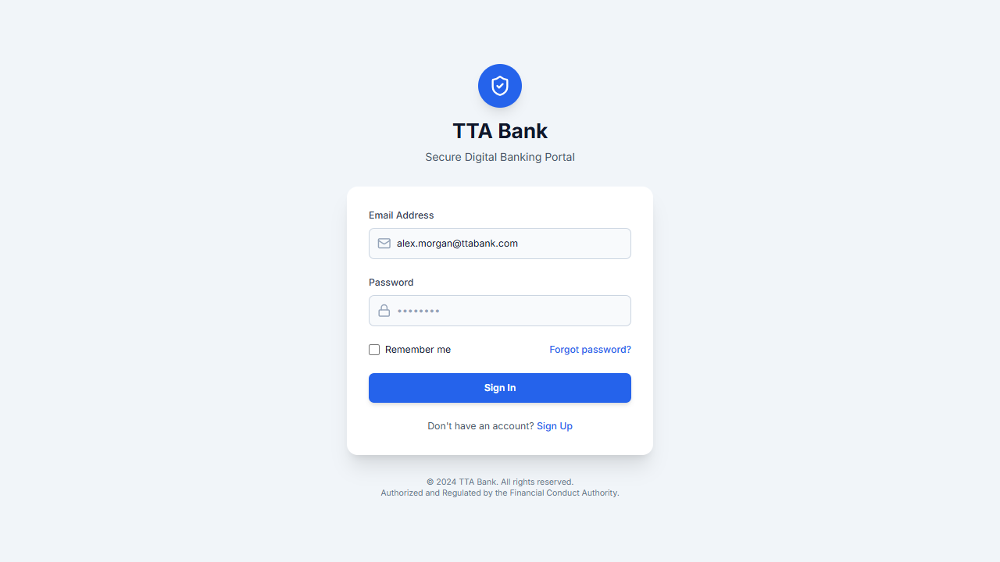

# TTA Bank Playwright Test Automation

This project contains the automated test suite for the TTA Bank application using Playwright and TypeScript.

## Features

- **Automated Login & Transfer Validation**: Validates the end-to-end flow of login and transferring funds, checking if the account balance successfully reduces by the transferred amount.
- **Custom HTML Reporting**: Utilizes `CustomTTAReporter.ts` which provides an enhanced, real-time HTML report with test statistics, filtering, and embedded assets.
- **Screenshots & Videos**: Playwright is configured to automatically record videos and take screenshots for tests. These assets are directly attached to the custom TTA HTML reports for easy debugging and visual confirmation of the test steps.

## Running Tests

To run the tests:

```bash
npx playwright test
```

After the tests run, the custom report will be generated in the `tta-report` directory. You can open `tta-report/index.html` to view the results along with the attached screenshots and videos.

## Sample Test Assets

Here is a sample screenshot captured during the test run:



And a sample test execution video:

[Watch Sample Video](./assets/sample_video.webm)
